# Network Data Analysis Coursework Report

## Cover Page

**Student Name:** Sanjana  
**K-number:** [INSERT K-NUMBER]  
**GitHub Repository:** [INSERT GITHUB LINK]  
**Module:** Network Data Analysis  
**Submission Date:** 17 April 2026

---

# Part 1: Wikidata Editor Networks

Three independent Wikidata Talk-page datasets were selected to represent small, medium, and large communication networks. The selected files were `BOT_REQUESTS.csv`, `PROJECT_CHAT.csv`, and `REQUEST_FOR_DELETION.csv`. Using one file at each scale makes it possible to compare structural behaviour without changing the network definition.

## Task A: Network Construction

### Small Dataset (`BOT_REQUESTS.csv`)

Each user was represented as a node and an edge was created when two users commented in the same page and thread pair. Grouping by `(page_name, thread_subject)` made it possible to build weighted co-participation ties directly from the CSV structure, with weights counting repeated shared-thread activity.

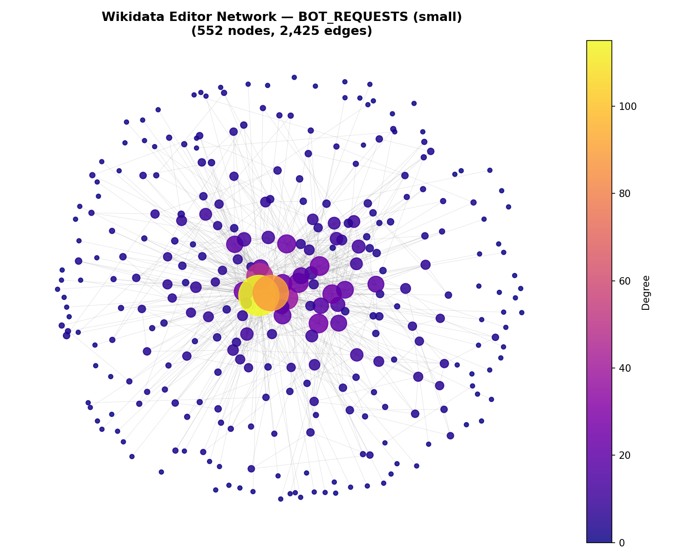

### Medium Dataset (`PROJECT_CHAT.csv`)

The same construction logic was applied to the medium graph, so differences in topology reflect the data rather than changes in implementation. This graph is visibly denser than the small network and contains far more repeated overlap between participants.

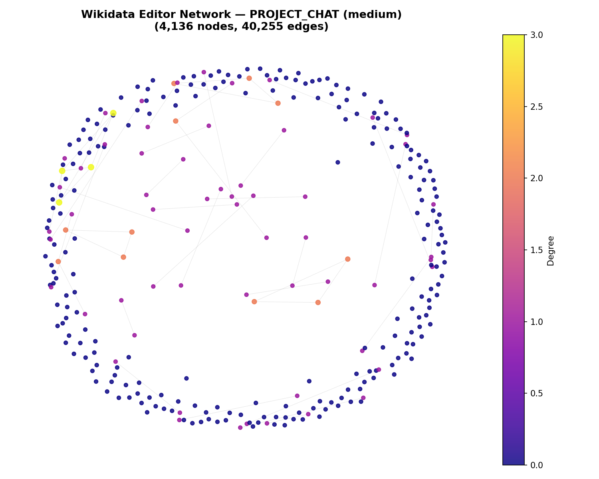

### Large Dataset (`REQUEST_FOR_DELETION.csv`)

The large graph was also built from weighted co-thread participation. Although it has the highest number of users, its density of overlap is lower than the medium case, which is consistent with broader participation and more episodic engagement.

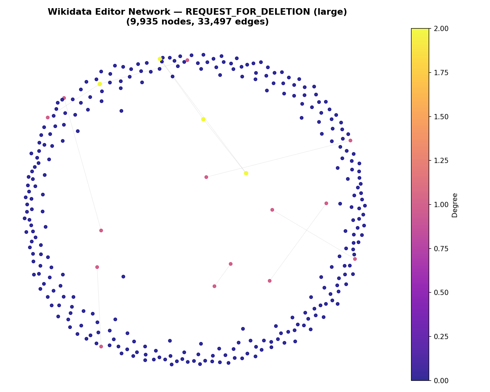

## Task B: Network Metrics

### Small Dataset (`BOT_REQUESTS.csv`)

The small graph contains 552 nodes and 2,425 edges, with a largest connected component of 519 nodes and 2,418 edges. Average degree in the largest component is 9.3179 and density is 0.017988. Clustering is 0.6878 and average shortest path length is 2.6027. Against the matched Erdős-Rényi baseline (\(C_{rand}=0.0185\), \(L_{rand}=3.0388\)), the observed network is far more clustered while remaining short-path, giving \(\sigma=43.4808\). Small-world structure here means editors form tight clusters around specific approval workflows, while any two editors in the main component stay reachable in roughly three hops. A contested bot-request decision can therefore move quickly from one local cluster to others.

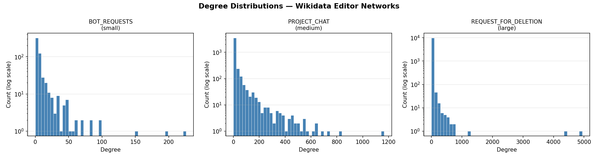

### Medium Dataset (`PROJECT_CHAT.csv`)

The medium graph has 4,136 nodes and 40,255 edges. In the largest connected component, average degree is 20.5107, density is 0.005228, clustering is 0.7022, and sampled average shortest path is 1.7500. Compared with the random baseline (\(C_{rand}=0.0052\), \(L_{rand}=6.3989\)), the resulting \(\sigma=491.3368\) is an even stronger small-world signal. Topic-based groups are dense, and a smaller set of cross-topic participants acts as bridges between those groups. Information can stay local for routine discussion but still jump communities fast when bridge users engage.

### Large Dataset (`REQUEST_FOR_DELETION.csv`)

The large graph contains 9,935 nodes and 33,497 edges. In its largest connected component, average degree is 6.7858, density is 0.000688, clustering is 0.3945, and sampled average shortest path is 1.3333. The random baseline gives \(C_{rand}=0.0006\) and \(L_{rand}=1.8667\), producing \(\sigma=852.7697\). Participation is broader and more episodic than in the smaller files, so local clustering weakens, but path lengths remain very short. A single viral deletion debate can still travel across the network quickly.

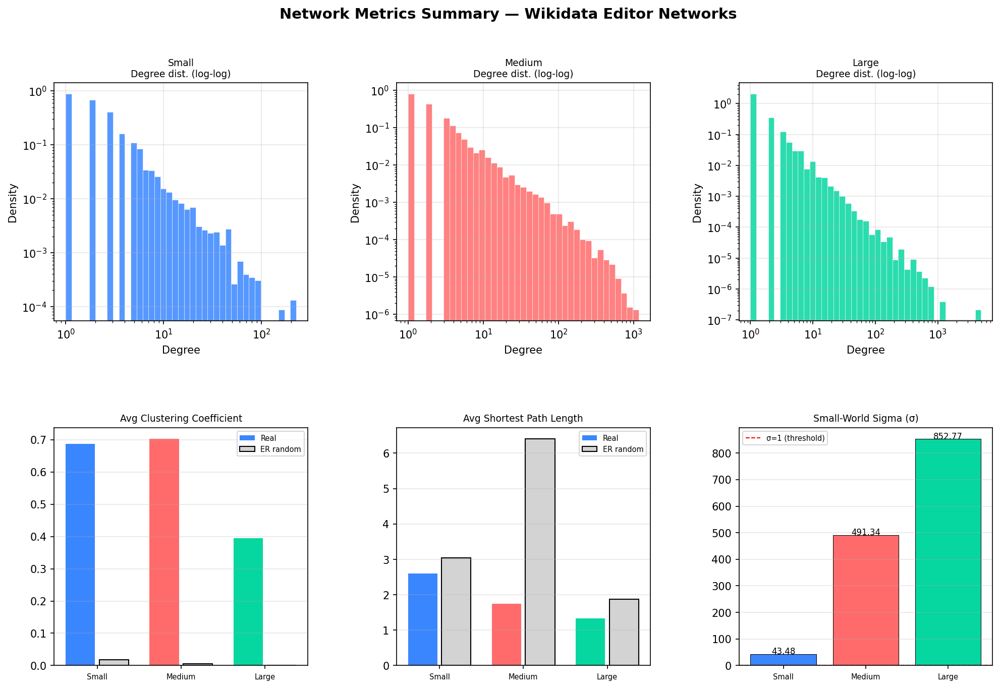

## Task C: Epidemic / Propagation Models

### Small Dataset (`BOT_REQUESTS.csv`)

Propagation was assessed using shortest-path distance, neighbourhood overlap, and weighted local exposure. In the sampled run, the selected pair had path length three and zero common neighbours, which suggests that spread had not yet diffused through a shared local neighbourhood. Priority rankings still elevated bridge candidates, because higher betweenness nodes sit on more shortest paths and are more likely to relay spread between clusters.

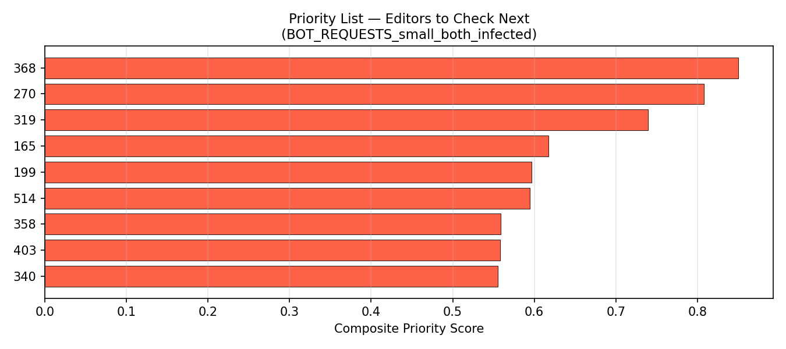

### Medium Dataset (`PROJECT_CHAT.csv`)

The medium graph produced a more populated priority list, with one-source risk concentrated near direct neighbours and two-source risk spreading across shared boundaries. Betweenness centrality drove the top of the list because bridge users connect topic clusters that otherwise have limited overlap.

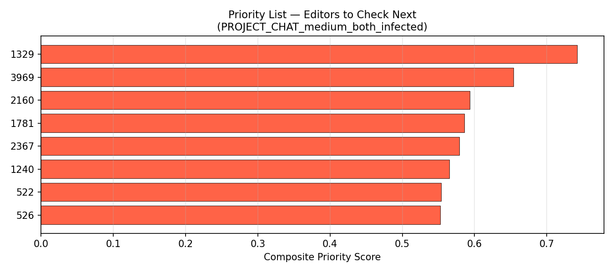

### Large Dataset (`REQUEST_FOR_DELETION.csv`)

In the largest network, priority rankings were dominated by a small number of structurally central actors. Sparse graphs rely on a few high-betweenness connectors that lie on the only shortest paths between distant clusters, so those users become natural chokepoints for propagation.

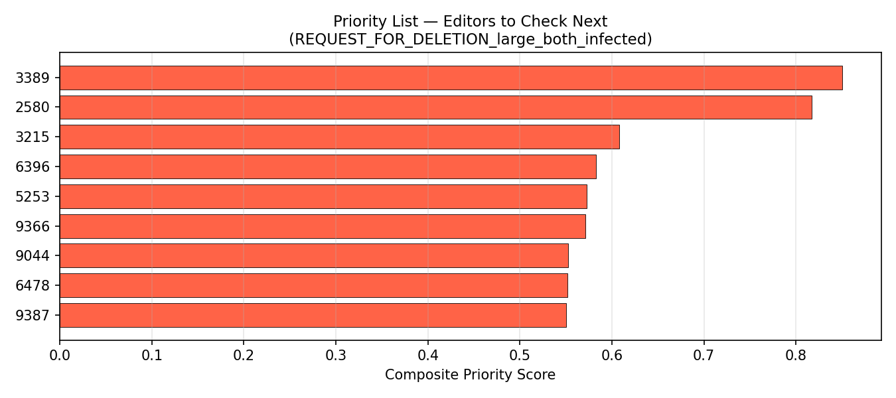

## Cross-Dataset Comparison

All three graphs sit far closer to the small-world region than to either a regular or purely random topology. The medium network shows the clearest balance of local cohesion and short paths, while the large network is broader and sparser in overlap density but still globally navigable. Using co-thread co-presence instead of reply structure likely increases clustering, and weighting ties by repeated participation improves the realism of the propagation model.

---

# Part 2: Leeds Road Network Analysis

## Task A: Spatial Network and Planarity

A one-square-kilometre area around Leeds centre was chosen through a local grid search that maximised accident count. The selected area contains 881 accidents, satisfying the requirement for a high-event study zone. The selected WGS84 bounds are north 53.804121, south 53.795192, east -1.530172, and west -1.545453.

The drivable road network was downloaded with OSMnx using drive-only filtering. Computed characteristics were diameter 27 (node-based), average street length 63.58 m, node density 208/km², intersection density 188/km², edge density 22,026.15 m/km², and average circuity 1.0315. Circuity this close to one indicates relatively direct movement and limited detour overhead in the selected central area. Planarity was assessed by checking crossings between sampled non-adjacent edge geometries, and the crossing estimate was 21. A planar graph cannot contain edge crossings in its geometric embedding unless new intersection nodes are introduced at those crossings. Leeds city centre includes flyovers and underpasses, and OSMnx encodes those as geometrically crossing edges without shared nodes, which is exactly what breaks planarity.

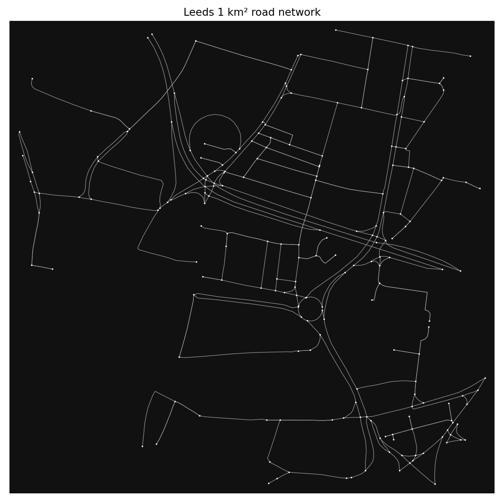

## Task B: Road Accidents

Accidents were aggregated across years, projected consistently, and snapped to nearest network edges to form edge-level intensity values. The mapped accident distribution shows concentration on specific connected corridors rather than uniform spread.

Spatial autocorrelation was tested using Moran’s I on edge-level accident counts with edge-neighbour relationships defined by shared nodes. The result was Moran’s I = 0.4101 with p = 0.001, showing significant positive autocorrelation. Point-pattern clustering was tested with a K-function procedure, which returned a minimum p-value of 0.01. Together, these measures indicate that accident risk is spatially clustered rather than randomly distributed.

Accident proximity to intersections was measured using a `spaghetti.Network` built from the road graph. Accident points were snapped onto the network using `snapobservations`, and each snapped point was converted to a fraction of arc length from the nearest intersection. The mean fraction was 0.2127, indicating that accidents occur much closer to junctions than to the midpoint of a road segment.

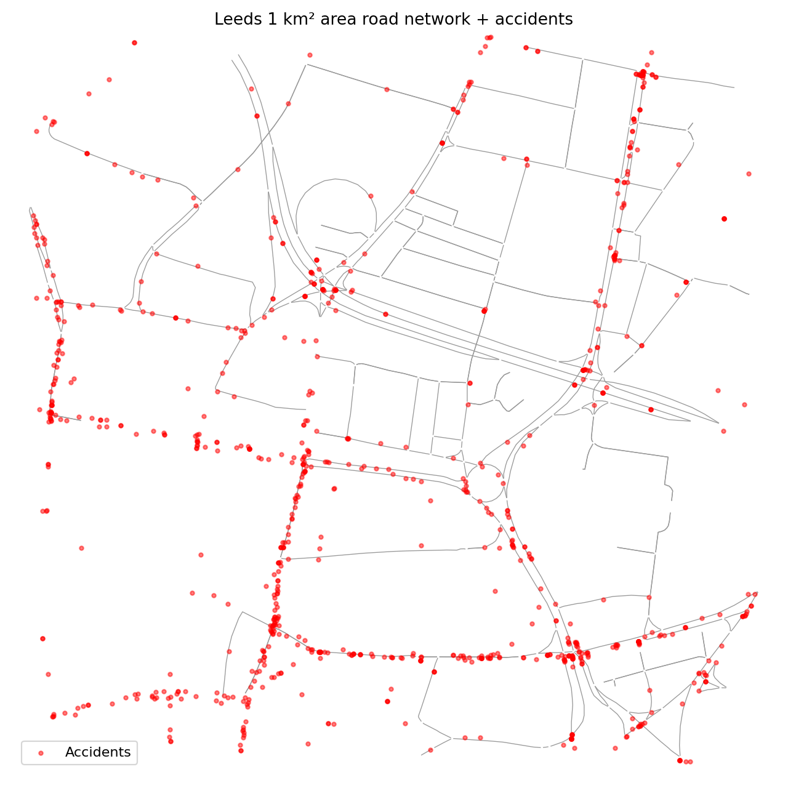

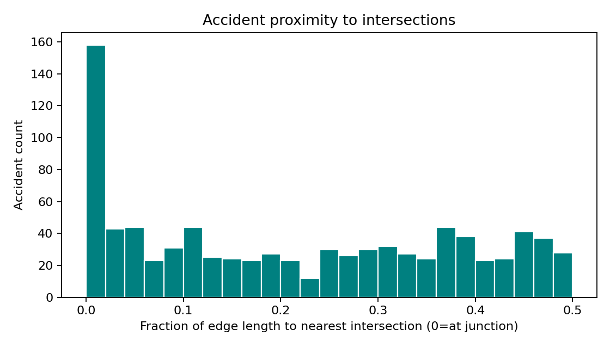

## Task C: Voronoi and Marathon Planning

Four seeds were selected using a spread-plus-connectivity strategy, choosing high-degree nodes across spatial quadrants to balance distribution and route accessibility. Network Voronoi assignment was then performed by shortest-path proximity from each node to the seed set.

The initial 1 km² attempt produced 0/4 feasible cells. Geometrically, this area is too small: the network diameter and available cycle structure are insufficient to support closed loops near 42 km. The refinement expanded the study area to 8 km × 8 km, shifted seeds where needed, and retried failed cells with subdivision when necessary. Under that expanded search, 4/4 cells succeeded. Smaller areas produce fairer, more local Voronoi partitions but cannot support marathon-length closed loops. Expanding to 8×8 km resolves feasibility, yet some cells move farther from participants, and the quadrant-spread seed strategy reduces but does not remove that trade-off.

Example successful loop lengths were 42002.76 m for Cell 1, 41979.64 m for Cell 2, 42000.03 m for Cell 3, and 41988.42 m for Cell 4. Output logs preserve the failed initial configuration and each retry step before the successful re-run.

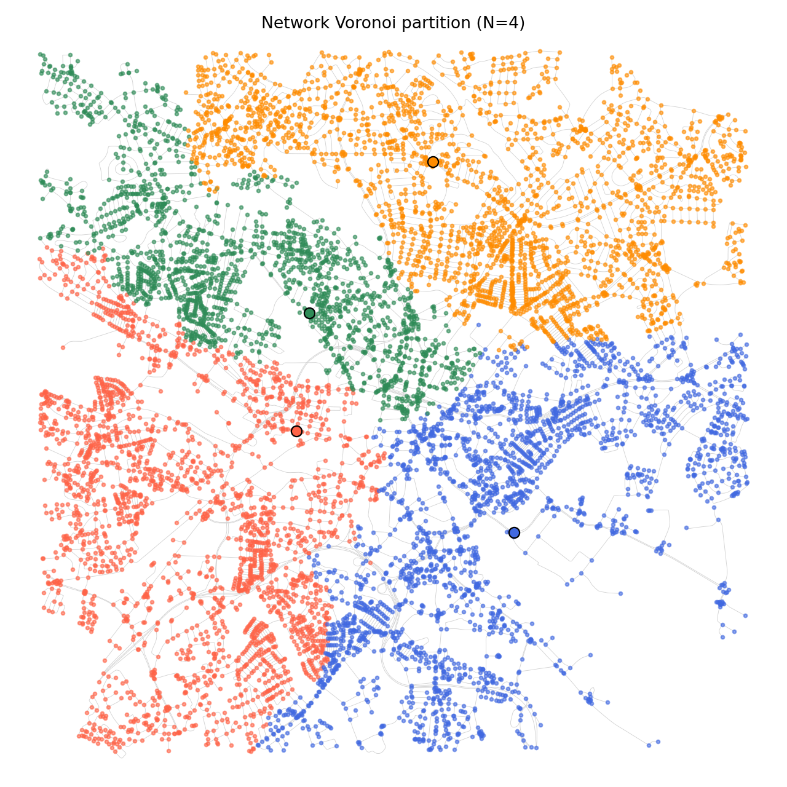

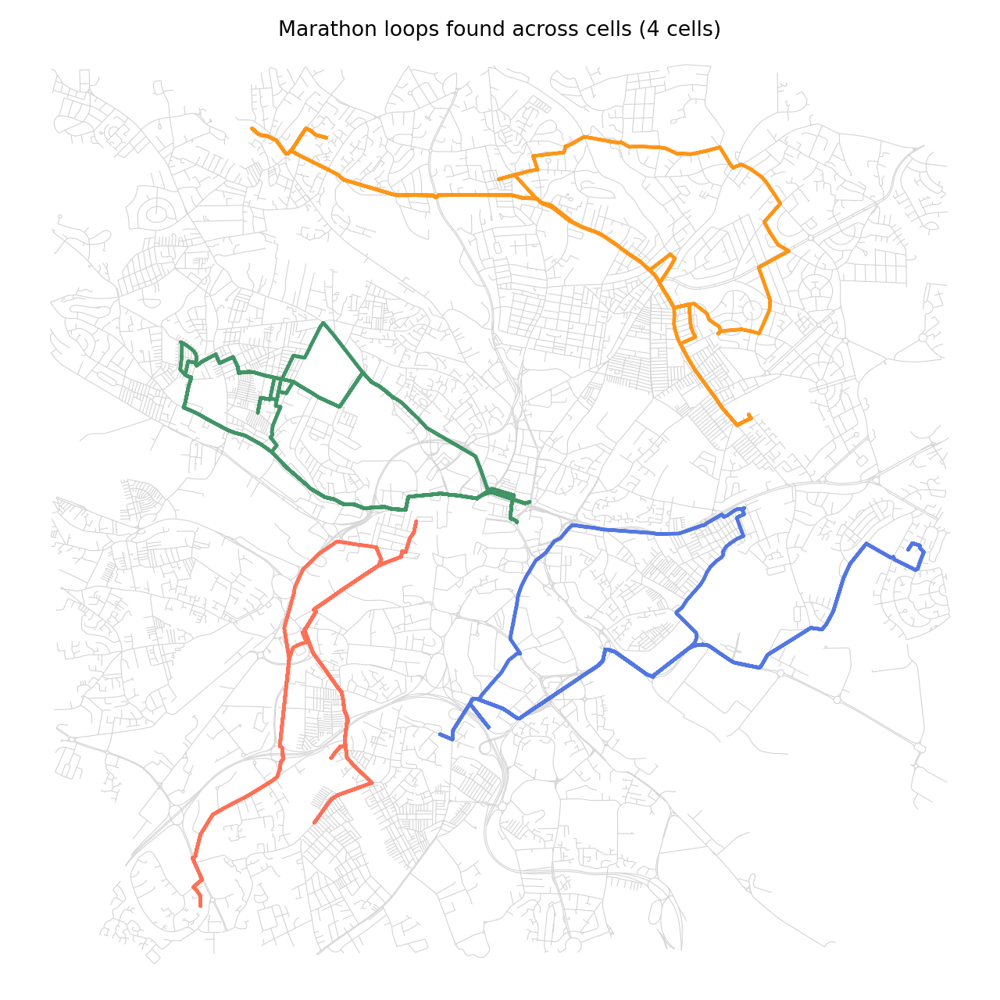

---

# References

Barabási, A.-L. (2016) *Network Science*. Cambridge University Press.

Boeing, G. (2017) ‘OSMnx: New methods for acquiring, constructing, analysing, and visualising complex street networks’, *Computers, Environment and Urban Systems*, 65, pp. 126-139.

Leeds City Council (2021) *Road traffic accidents dataset*. Available at: https://data.gov.uk/dataset/6efe5505-941f-45bf-b576-4c1e09b579a1/road-traffic-accidents (Accessed: 17 April 2026).

Newman, M. (2018) *Networks*. 2nd edn. Oxford University Press.

OpenStreetMap contributors (2026) *OpenStreetMap data*. Available at: https://www.openstreetmap.org (Accessed: 17 April 2026).

PySAL developers (2026) *PySAL documentation*. Available at: https://pysal.org (Accessed: 17 April 2026).
